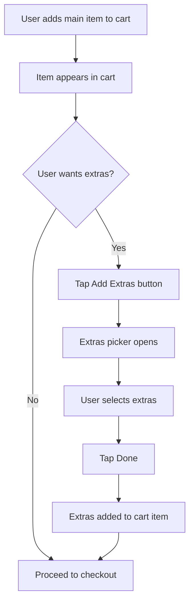

# Flatbread Menu Update & Extras Feature Plan

## Overview
This plan covers two main changes:
1. Replace toast-based items with the new spicy flatbread
2. Add an "Extras" feature for add-on breakfast items

## Part 1: Flatbread Menu Updates

### Current Menu Items to Update
- "Scrambled Eggs on Toast" → "Scrambled Eggs with Flatbread"
- "Poached Eggs on Avocado Toast" → "Poached Eggs with Avocado & Flatbread"
- "Homemade Flatbread" → Update description to mention spicy chicken, onions, peppers

### New Images Available
- `/open_flatbread.jpg` - Shows the inside of the flatbread
- `/quarter_flatbread.jpg` - Quarter section view
- `/Flatbread.webp` - Existing image

### Menu Changes Required
Update mock menu items in:
- `src/app/api/menu/route.ts`
- `src/app/api/menu/admin/route.ts`

---

## Part 2: Extras Feature

### Concept
Allow customers to add extra items to their order. Extras are small add-on items like:
- Extra eggs (fried, scrambled, poached)
- Mushrooms
- Tomatoes
- Cheese
- Fish fingers
- Fried dumplings
- Plantains
- Beans

### Data Model Changes

#### MenuItem Model Update
```typescript
export interface MenuItem {
  id: string;
  name: string;
  description: string | null;
  price_pence: number;
  category: string;  // 'Hot', 'Light', 'Drinks', 'Extras'
  image_url: string | null;
  available: boolean;
  sort_order: number;
  is_extra: boolean;  // NEW: true for extras, false for main items
}
```

#### CartItem Model Update
```typescript
export interface CartItem {
  menuItem: MenuItem;
  quantity: number;
  extras: CartExtra[];  // NEW: extras attached to this item
}

export interface CartExtra {
  menuItem: MenuItem;  // The extra item
  quantity: number;
}
```

#### OrderItem Model Update
```typescript
export interface OrderItem {
  id: string;
  order_id: string;
  menu_item_id: string;
  quantity: number;
  item_name: string;
  item_price_pence: number;
  extras: OrderItemExtra[];  // NEW: extras for this item
}

export interface OrderItemExtra {
  id: string;
  order_item_id: string;
  menu_item_id: string;
  quantity: number;
  item_name: string;
  item_price_pence: number;
}
```

### UI Components

#### 1. MenuItemCard Update
- Add "Add Extras" button when item is in cart
- Opens extras picker dialog/sheet

#### 2. New ExtrasPicker Component
- Bottom sheet or dialog showing available extras
- Each extra has +/- buttons
- Shows total price of selected extras
- "Done" button to confirm

#### 3. Cart Display Update
- Show extras under each cart item
- Show extra prices

### User Flow



### API Changes

#### POST /api/orders
- Accept extras array in each order item
- Create order_items as before
- Create order_item_extras for each extra

#### GET /api/orders
- Include extras in the response
- Join order_item_extras table

### Database Schema (when using real DB)

```sql
-- New table for extras
CREATE TABLE order_item_extras (
  id UUID PRIMARY KEY DEFAULT gen_random_uuid(),
  order_item_id UUID REFERENCES order_items(id) ON DELETE CASCADE,
  menu_item_id UUID REFERENCES menu_items(id),
  quantity INTEGER NOT NULL,
  item_name TEXT NOT NULL,
  item_price_pence INTEGER NOT NULL,
  created_at TIMESTAMP DEFAULT NOW()
);
```

### Extras Menu Items
Create these as menu items with `is_extra: true`:

| Name | Price | Image |
|------|-------|-------|
| Extra Fried Egg | 50p | /eggs_boiled_fried_scrambled_poached.jpg |
| Extra Scrambled Egg | 75p | /eggs_boiled_fried_scrambled_poached.jpg |
| Extra Mushrooms | 50p | - |
| Extra Tomatoes | 50p | - |
| Extra Cheese | 50p | - |
| Extra Fish Fingers (2) | £1.00 | /fish_fingers.png |
| Extra Fried Dumplings (2) | £1.00 | /fried_dumplings.jpg |
| Extra Plantains | 75p | /fried_plantains.png |
| Extra Baked Beans | 50p | - |

---

## Implementation Order

1. **Update menu items** - Replace toast items with flatbread
2. **Update MenuItem model** - Add `is_extra` field
3. **Create extras menu items** - Add to mock data
4. **Update CartItem model** - Add extras array
5. **Create ExtrasPicker component** - UI for selecting extras
6. **Update MenuItemCard** - Add "Add Extras" button
7. **Update cart display** - Show extras with items
8. **Update order API** - Handle extras in order creation
9. **Update kitchen display** - Show extras on orders
10. **Update tests** - Add tests for extras functionality

---

## Questions for User

1. Should extras be added per-item or per-order?
   - Per-item: Each main dish can have its own extras
   - Per-order: Extras are added once for the whole order

2. Should there be a limit on quantity of extras?

3. Any other extras to add to the list?
